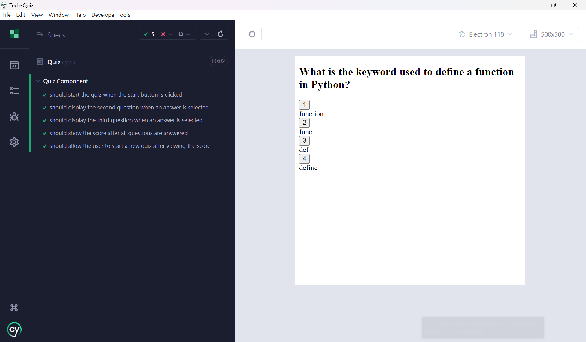

# Tech-Quiz

## User Story
AS AN aspiring developer<br>
I WANT to take a tech quiz<br>
SO THAT I can test my knowledge and improve my skills


## Description
Tech-Quiz is a web application that allows users to take a quiz on various technical topics. The application is built using React for the frontend and Express with MongoDB for the backend. It also includes end-to-end testing with Cypress.


## Features

- Start a quiz with random questions
- Answer multiple-choice questions
- View the score after completing the quiz
- Restart the quiz to try again
- Responsive design using Bootstrap
- End-to-end testing with Cypress


## Installation

1. Clone the repository:

   ```sh
   git clone https://github.com/your-username/tech-quiz.git
   cd tech-quiz
   ```

2. Install dependencies:

   ```sh
   npm run install
   ```

3. Seed the database (optional but recommended):

   ```sh
   npm run seed
   ```

## Running the Application

To start the application in development mode, run:

```sh
npm run start:dev
```

This will start both the client and server concurrently. The client will be available at `http://localhost:3000` and the server will run on `http://localhost:3001`.

## Running Tests

To run Cypress tests, use the following commands:

- Open Cypress test runner:

  ```sh
  npm run cy
  ```

- Run Cypress tests in headless mode:

  ```sh
  npm run test
  ```

## Project Structure

```
.
├── client
│   ├── public
│   ├── src
│   │   ├── assets
│   │   ├── components
│   │   ├── models
│   │   ├── services
│   │   ├── App.css
│   │   ├── App.tsx
│   │   ├── main.tsx
│   ├── .eslintrc.cjs
│   ├── index.html
│   ├── package.json
│   ├── tsconfig.json
│   ├── tsconfig.node.json
│   ├── vite.config.ts
├── cypress
│   ├── component
│   ├── e2e
│   ├── fixtures
│   ├── support
│   ├── tsconfig.json
│   ├── cypress.config.ts
├── server
│   ├── src
│   │   ├── config
│   │   ├── controllers
│   │   ├── models
│   │   ├── routes
│   │   ├── seeds
│   │   ├── server.ts
│   ├── .env
│   ├── package.json
│   ├── tsconfig.json
├── .gitignore
├── .npmrc
├── package.json
├── README.md
├── tsconfig.json
├── vite.config.d.ts
├── vite.config.js
├── vite.config.ts
```


## License

This project is licensed under the MIT License.

## Demo
https://drive.google.com/file/d/1BN8Osjfo0xrv_OER_lG3rQY4afXiG8Hd/view?usp=sharing

